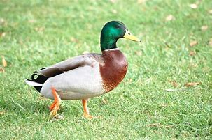

# Pato :duck:

- Pato é o **nome comum para numerosas espécies de aves aquáticas pertencentes à família Anatidae** . Os patos são menores e de pescoço mais curto que os cisnes e gansos, que são os membros da mesma família.
#
#

  
  
<em>"A Imagem mostra um pato no campo"</em>

