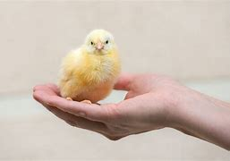

# Pinto :baby_chick:

- Filhote de Galinha.
#

  
  
<em>"A Imagem mostra um Pintinho na Mão de um Pessoa"</em>

### Meu Pintinho Amarelinho
- Música Infantil
  
_Letra da Música:_

Meu pintinho amarelinho
Cabe aqui na minha mão (na minha mão)
Quando quer comer bichinhos
Com seus pézinhos ele cisca o chão

Meu pintinho amarelinho
Cabe aqui na minha mão (na minha mão)
Quando quer comer bichinhos
Com seus pézinhos ele cisca o chão

Ele bate as asas
Ele faz piu-piu!
Mas tem muito medo
É do gavião

Ele bate as asas
Ele faz piu-piu!
Mas tem muito medo
É do gavião

Meu pintinho amarelinho
Cabe aqui na minha mão (na minha mão)
Quando quer comer bichinhos
Com seus pézinhos ele cisca o chão

Meu pintinho amarelinho
Cabe aqui na minha mão (na minha mão)
Quando quer comer bichinhos
Com seus pézinhos ele cisca o chão

Ele bate as asas
Ele faz piu-piu!
Mas tem muito medo
É do gavião

Ele bate as asas
Ele faz piu-piu!
Mas tem muito medo
É do gavião